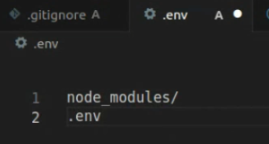
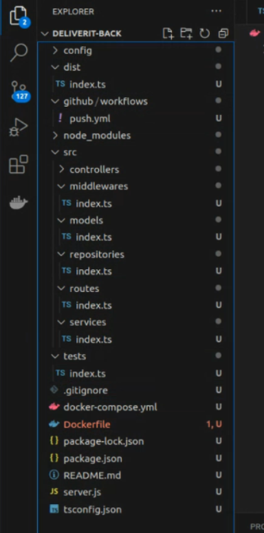
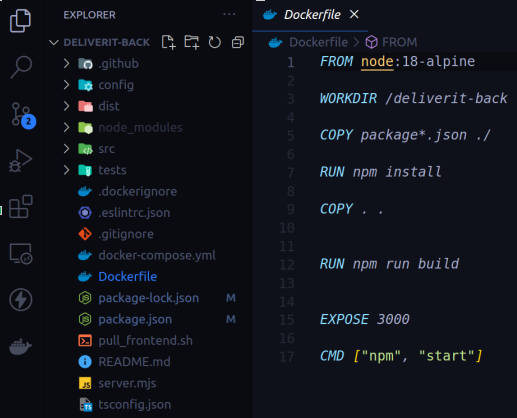
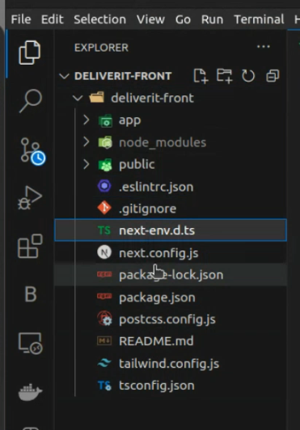
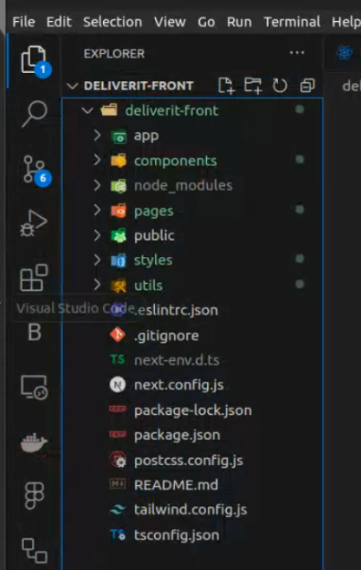
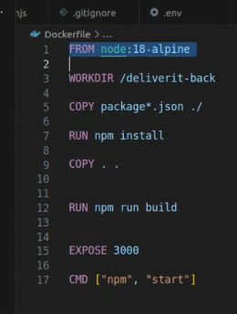
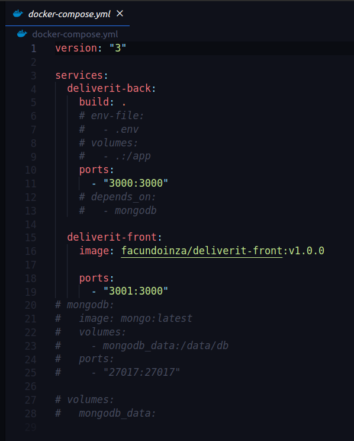
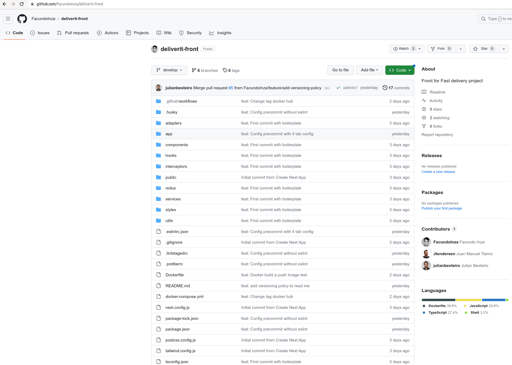

# GitFlow Workflow for DeliverIT

Our team will be using the GitFlow workflow for managing the development and maintenance of our application, DeliverIT as a solution to the problem of maintaining a software project in which several developers or teams are collaborating.

## Branching Strategy

Our repository will have two main branches with an infinite lifetime:

1. **Main**: This branch will contain the official release history, and each commit on this branch will represent a new production release. All the code in the master branch is deployable and is essentially production-ready.

2. **Develop**: This branch serves as an integration branch for features. It contains the complete history of the project, whereas main contains an abridged version. All the code in the develop branch is in a beta state, testable and runnable, but not necessarily production-ready.

In addition to these main branches, we will maintain various support branches:

- **Feature branches**: These branches are used to develop new features for the upcoming or a distant future release. When starting development of a feature, the target release in which this feature will be incorporated may well be unknown at that point. The essence of a feature branch is that it exists as long as the feature is in development, but will eventually be merged back into develop or discarded.

- **Bugfix branches**: These branches are used to prepare code fixes for the upcoming or a distant future release. They allow for minor bug fixes and preparing meta-data for a release (version number, build dates, etc.). By doing all of this work on a bugfix branch, the develop branch is cleared to receive features for the next big release.

- **Hotfix branches**: These branches are very much like bugfix branches in that they are also meant to prepare for a new production release, albeit unplanned. They arise from the necessity to act immediately upon an undesired state of a live production version. When a critical bug in a production version must be resolved immediately, a hotfix branch may be branched off from the corresponding tag on the master branch that marks the production version.

## Getting Started

First, run the development server:

```bash
npm run dev
# or
yarn dev
# or
pnpm dev
```

Open [http://localhost:3000](http://localhost:3000) with your browser to see the result.

You can start editing the page by modifying `app/page.tsx`. The page auto-updates as you edit the file.

This project uses [`next/font`](https://nextjs.org/docs/basic-features/font-optimization) to automatically optimize and load Inter, a custom Google Font.

## Learn More

To learn more about Next.js, take a look at the following resources:

- [Next.js Documentation](https://nextjs.org/docs) - learn about Next.js features and API.
- [Learn Next.js](https://nextjs.org/learn) - an interactive Next.js tutorial.

You can check out [the Next.js GitHub repository](https://github.com/vercel/next.js/) - your feedback and contributions are welcome!

## Deploy on Vercel

The easiest way to deploy your Next.js app is to use the [Vercel Platform](https://vercel.com/new?utm_medium=default-template&filter=next.js&utm_source=create-next-app&utm_campaign=create-next-app-readme) from the creators of Next.js.

Check out our [Next.js deployment documentation](https://nextjs.org/docs/deployment) for more details.

test

# GitFlow Workflow for DeliverIT

Our team will be using the GitFlow workflow for managing the development and maintenance of our application, DeliverIT as a solution to the problem of maintaining a software project in which several developers or teams are collaborating.

----------------------------------------------------------------------------------


# Project Creation Process

## Back end

The back-end part of the project, named **deliverit-back**, uses Express, NodeJs, Typescript, and configuration files necessary for the application to work with Docker.

The basic steps for its construction were as follows:

1. Create an empty repository on Github.

2. Clone the repository to the local computer.

3. Manually create the empty folders and files for the back-end by following this basic structure:


4. Generate the "package.json" file with the command:

	$ npm init


5. Install Typescript with the command:

	$ npm i typescript –save-dev


6. Add the dependencies to be used in the "package.json" file, so they can be installed later.

7. Create the Typescript configuration file with:

	$ npx tsc –init


8. Create the "dist" folder in the root of "deliverit-back."

9. Add an "index.ts" file to each project folder to prevent all files from being uploaded to Github.

10. Inside the "github/workflows" folder, create a "push.yml" file.

11. Complete the ".gitignore" file with:


12. Create the ".env" file in the root and fill it with the required configuration:




13. Create the "docker-compose.yml" file in the root, shaping the folder and file structure as follows:




14. Complete the "dockerfile" with the configuration to build the image:




15. Complete the "docker-compose.yml" file with the following content:


16. Push the initial basic repository to Github, resulting in:


17. Create a branch called "develop" on Github and set it as the default branch.


Our team performed various tests to ensure that the "deliverit-back" repository is functioning and ready to start developing functionalities for the next sprint.

-----------------------------------------------------------------------------------------------------------------


## Front-End

The front-end part of the project named  **deliverit-front** uses NextJs as the framework, along with selected languages, libraries, and frameworks such as Typescript, React, and Tailwind. Configuration files necessary for the application to work with Docker have also been added.

Typescript, React, Tailwind.


To create the front-end project, follow these steps:


1. On your local computer, create a project folder called "deliverit-front" 

2. Install the NextJs framework using the following command:

	$ npx create-next-app@latest

3. As a result of the previous command, the following folder structure is automatically created for the Front-End:




4. Manually create the "Components" and "utils" folders in the root, and within each folder, add an "index.tsx" file.

5. Manually create the "styles" folder in the root and add a "globals.css" file within it:




6. Complete the content of the "tsconfig.json" file.

7. Create the "services," "hooks," "redux," "adapters," and "interceptors" folders in the root (the last one for 
   intercepting axios requests), and within each folder, create an "index.ts" file.

8. For the configuration of the ".eslintrc.json" file, adopt the recommended settings from the project's 
   instructions, available at the following link:

     https://github.com/Faridmurzone/linters-and-config  


9. Manually create the "Dockerfile" and define its content as follows:




10. Manually create the "docker-compose.yml" file and define its content as follows:




11. Upload the project to the empty repository previously created on Github using the following command:

	$ git remote add origin https://github.com/FacundoInza/deliverit-front.git

    The result should look like this:




Our team performed various tests to ensure that the "deliverit-front" repository is functioning and ready to start developing functionalities for the next sprint.


