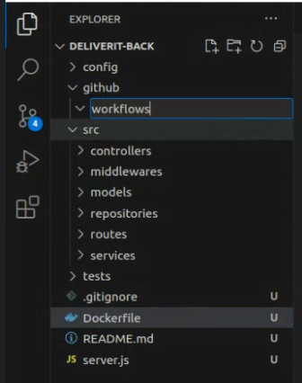
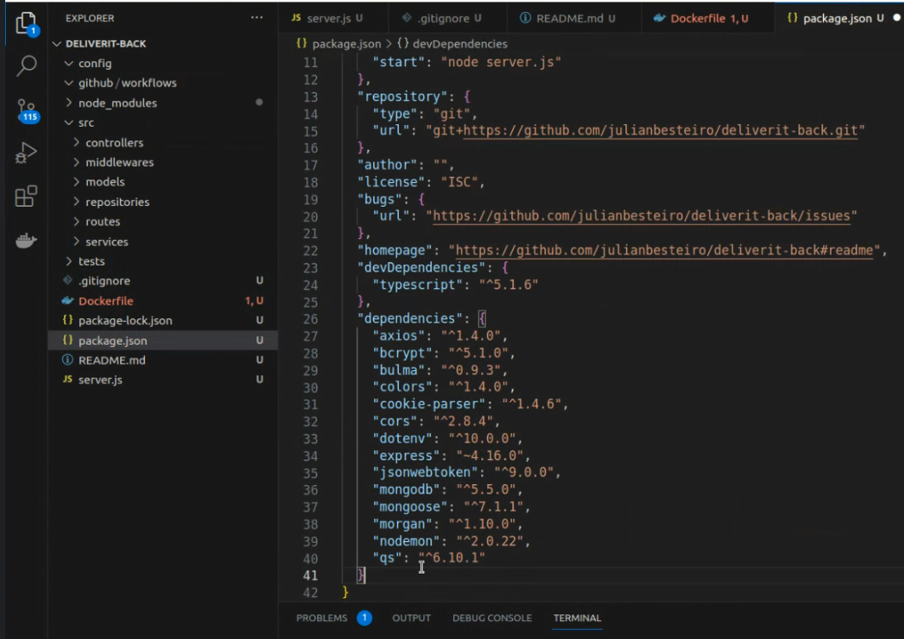

# GitFlow Workflow for DeliverIT

Our team will be using the GitFlow workflow for managing the development and maintenance of our application, DeliverIT as a solution to the problem of maintaining a software project in which several developers or teams are collaborating.

## Branching Strategy

Our repository will have two main branches with an infinite lifetime:

1. **Main**: This branch will contain the official release history, and each commit on this branch will represent a new production release. All the code in the master branch is deployable and is essentially production-ready.

2. **Develop**: This branch serves as an integration branch for features. It contains the complete history of the project, whereas main contains an abridged version. All the code in the develop branch is in a beta state, testable and runnable, but not necessarily production-ready.

In addition to these main branches, we will maintain various support branches:

- **Feature branches**: These branches are used to develop new features for the upcoming or a distant future release. When starting development of a feature, the target release in which this feature will be incorporated may well be unknown at that point. The essence of a feature branch is that it exists as long as the feature is in development, but will eventually be merged back into develop or discarded.

- **Bugfix branches**: These branches are used to prepare code fixes for the upcoming or a distant future release. They allow for minor bug fixes and preparing meta-data for a release (version number, build dates, etc.). By doing all of this work on a bugfix branch, the develop branch is cleared to receive features for the next big release.

- **Hotfix branches**: These branches are very much like bugfix branches in that they are also meant to prepare for a new production release, albeit unplanned. They arise from the necessity to act immediately upon an undesired state of a live production version. When a critical bug in a production version must be resolved immediately, a hotfix branch may be branched off from the corresponding tag on the master branch that marks the production version.

## Getting Started

First, run the development server:

```bash
npm run dev
# or
yarn dev
# or
pnpm dev
```

Open [http://localhost:3000](http://localhost:3000) with your browser to see the result.

You can start editing the page by modifying `app/page.tsx`. The page auto-updates as you edit the file.

This project uses [`next/font`](https://nextjs.org/docs/basic-features/font-optimization) to automatically optimize and load Inter, a custom Google Font.

## Learn More

To learn more about Next.js, take a look at the following resources:

- [Next.js Documentation](https://nextjs.org/docs) - learn about Next.js features and API.
- [Learn Next.js](https://nextjs.org/learn) - an interactive Next.js tutorial.

You can check out [the Next.js GitHub repository](https://github.com/vercel/next.js/) - your feedback and contributions are welcome!

## Deploy on Vercel

The easiest way to deploy your Next.js app is to use the [Vercel Platform](https://vercel.com/new?utm_medium=default-template&filter=next.js&utm_source=create-next-app&utm_campaign=create-next-app-readme) from the creators of Next.js.

Check out our [Next.js deployment documentation](https://nextjs.org/docs/deployment) for more details.

test

# GitFlow Workflow for DeliverIT

Our team will be using the GitFlow workflow for managing the development and maintenance of our application, DeliverIT as a solution to the problem of maintaining a software project in which several developers or teams are collaborating.

----------------------------------------------------------------------------------


Crear el back end

En Github crear un repositorio vacío con nombre “ deliverit-back ”

Clonar el repositorio a la computadora		$ git clone		

En la carpeta del proyecto clonado, crear las carpetas y archivos segun la siguiente estructura:



Generar el archivo “ package.json ”:			$ npm init 		
Instalar Typescript					$ npm i typescript –save-dev

Agregar las siguientes dependencias al archivo “ package.json ”:



Crear el archivo de configuración tsconfig.json para Typescript con el comando:
	$ npx tsc –init


La parte back-end del proyecto llamado “ deliverit-back “ utiliza Express  NodeJs . 

Para la construccion del mismo básicamente :
1- Se creó un repositorio (vacío) en Github 
2- Se clonó ese repositorio a la computadora de trabajo
3- Se crearon las carpetas y archivos del back según la siguiente estructura básica:


4- Se generó el archivo “package.json” con el comando:

	$ npm init

5- Se instaló Typescript con el comando:

	$ npm i typescript –save-dev

6- Se agregaron en el archivo “package.json” las dependencias a utilizar para posteriormente ser   
     instaladas.

7- Se creó el archivo de configuración para Typescript con:

	“ $ npx tsc –init “ 

8- Se creó la carpeta “dist” en la raiz de  “deliverit-back”

9- A cada una de las carpetas del proyecto se les agregó en su interior un archivo “ index.ts ” para 
    que no se suban todas a Github.

10- Dentro de la carpetas “github / workflows” se crea un arch “push.yml”

11- Se completa el arch “.gitignore” con: